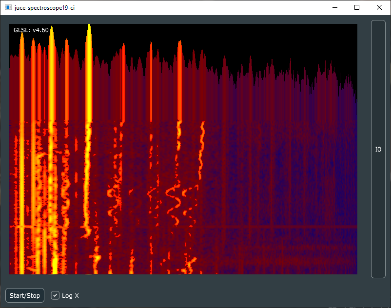

# Introduction

This is a pretty OpenGL spectroscope for the awesome [JUCE](https://github.com/WeAreROLI/JUCE) cross platform C++ programming framework.

## Usage

This repository is meant to be included as a git submodule in a main project, see for instance [JammerNetz](https://github.com/christofmuc/JammerNetz) for an example how this is used.

## Example

In order to build this library standalone and get a working example program, there is a [separate little repository called juce-spectroscope19-ci](https://github.com/christofmuc/juce-spectroscope19-ci) that you can use. This also documents the build process.

Here is a screenshot of the program in the example repo action rendering a youtube video of a performance of [Pergolesi's Stabat mater](https://www.youtube.com/watch?v=FjJ02agjjdo):

## Third party libraries used

Please understand that this software uses the following third party libraries, and you are implicitly accepting their license terms as well when using this software. Please visit the links and familarize yourself with their conditions. 

For the sake of easy accessibility, the cmake build of this example software automatically downloads and uses the following components:

  1. The awesome [JUCE](https://juce.com/) library for cross-platform C++ development.
  2. For wrangling OpenGL in its complexity I say thank you to the [GLEW](http://glew.sourceforge.net/) library.
  3. For building complex projects I use CMake, and with [juce-cmake](https://github.com/remymuller/juce-cmake) this becomes much easier! 
  4. On Windows, nothing beats for me ASIO drivers for high-quality low-latency audio drivers, and our thanks go to the company [Steinberg](https://www.steinberg.net/de/home.html) for still providing their [ASIO SDK](https://www.steinberg.net/de/company/developer.html). Please check out their licensing especially!

## Licensing

As some substantial work has gone into the development of this and related software, I decided to offer a dual license - AGPL, see the LICENSE.md file for the details, for everybody interested in how this works and willing to spend some time her- or himself on this, and a commercial MIT license available from me on request. Thus I can help the OpenSource community without blocking possible commercial applications.

## Contributing

All pull requests and issues welcome, I will try to get back to you as soon as I can. Due to the dual licensing please be aware that I will need to request transfer of copyright on accepting a PR. 

## About the author

Christof is a lifelong software developer having worked in various industries, and can't stop his programming hobby anyway. 
