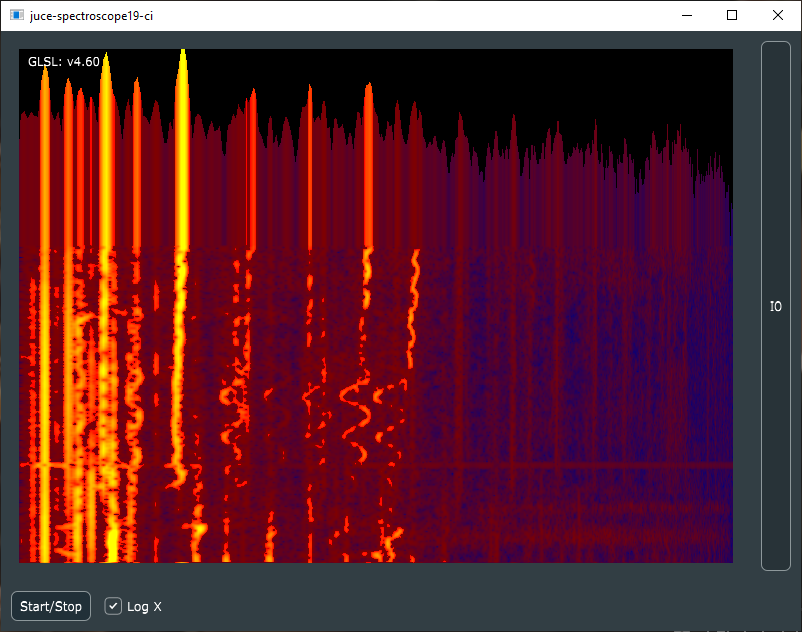

[](https://github.com/christofmuc/juce-spectroscope19/actions/workflows/build.yml)

# JUCE Spectroscope

JUCE Spectroscope is a reusable spectrum analyzer and OpenGL waterfall display for the [JUCE](https://github.com/juce-framework/JUCE) cross-platform C++ framework.



The repository supports two use cases:

- a standalone microphone-input demo that builds the library, UI, and tests together;
- a CMake subdirectory or git submodule consumed by applications such as [JammerNetz](https://github.com/christofmuc/JammerNetz).

## CMake targets

| Target | Purpose |
| --- | --- |
| `juce-spectroscope-analysis` | Headless FFT plus logarithmic tracked-pitch analysis with JUCE core, audio-basics, and DSP dependencies. |
| `juce-spectroscope-ui` | OpenGL spectrum and waterfall visualization. |
| `juce-spectroscope19` | Compatibility target linking the analysis and UI targets. |
| `JuceSpectroscopeDemo` | Optional standalone microphone-input application. |

## Quick start

Top-level builds download a checksum-pinned JUCE revision and enable the demo and analyzer tests by default:

```sh
git clone https://github.com/christofmuc/juce-spectroscope19.git
cd juce-spectroscope19
cmake -S . -B build -DCMAKE_BUILD_TYPE=RelWithDebInfo
cmake --build build --parallel
ctest --test-dir build --output-on-failure
```

Windows with a Visual Studio generator is multi-config, so pass `--config RelWithDebInfo` to the build and `-C RelWithDebInfo` to CTest. See [Building and using the standalone demo](docs/standalone-demo.md) for complete Windows, macOS, and Linux instructions.

## Embedding the component

A parent project may provide its own `juce-static` target or JUCE CMake targets. In that mode this repository never downloads or compiles a second JUCE checkout:

```cmake
add_subdirectory(modules/juce-spectroscope19)
target_link_libraries(MyApplication PRIVATE juce-spectroscope19)
```

Audio callbacks must not call `Spectrogram::process()` directly. Copy audio into a bounded preallocated queue, perform analysis on a worker thread, and let the UI poll completed spectra at a bounded rate. The standalone demo is a working reference implementation.

The analyzer publishes two synchronized views of every analysis instant: a full-resolution FFT row for transients, noise, harmonics, and timbre, plus an absolute log-frequency field of tracked fundamentals. Pitch-colour mode renders the FFT as a greyscale substrate and adds circle-of-fifths colour only at stable fundamentals; overtones remain visible in grey. Detection adapts to the current signal and suppresses peaks explained as harmonics of a lower note. The logarithmic tracker is an independent implementation inspired by the general ColorChord approach; ColorChord is not a source or runtime dependency.

See [Integrating JUCE Spectroscope](docs/integration.md) for target selection, ownership, lifecycle, and threading guidance.

## Build options

| Option | Top-level default | Purpose |
| --- | ---: | --- |
| `JUCE_SPECTROSCOPE_BUILD_DEMO` | `ON` | Build the standalone demo. |
| `JUCE_SPECTROSCOPE_BUILD_TESTS` | `ON` | Build and register analyzer tests. |
| `JUCE_SPECTROSCOPE_BUILD_GUI_TESTS` | `OFF` | Register lifecycle tests that require an interactive Windows desktop and OpenGL driver. |
| `JUCE_SPECTROSCOPE_FETCH_JUCE` | `ON` | Fetch pinned JUCE when no parent JUCE target exists. |
| `JUCE_SPECTROSCOPE_VALIDATE_SHADERS` | `OFF` | Validate shaders with an installed `glslangValidator`. |

All three build, test, and fetch options default to `OFF` when this repository is added by a parent project. Shader validation never downloads a moving tool archive.

## Historical demo repository

The archived [juce-spectroscope19-ci](https://github.com/christofmuc/juce-spectroscope19-ci) repository originally documented the standalone application, git submodules, and AppVeyor builds. Its useful documentation and demo responsibilities now live here. The old GLEW, ASIO SDK, WebKit, `juce-cmake`, and AppVeyor setup is intentionally not required by the current build.

The screenshot above originated in that demo while rendering a [performance of Pergolesi's Stabat mater](https://www.youtube.com/watch?v=FjJ02agjjdo).

## Third-party software

Standalone builds use:

1. [JUCE](https://juce.com/) at the revision pinned in `CMakeLists.txt`;
2. CMake for project generation and dependency integration;
3. optionally, an installed [glslangValidator](https://github.com/KhronosGroup/glslang) for build-time shader validation.

Review and accept the applicable third-party licence terms before distribution.

## Licensing

This project is distributed under the GNU Affero General Public License by default. A commercial MIT licence is available from the author on request; see [LICENSE.md](LICENSE.md).

## Contributing

Issues and pull requests are welcome. Due to the dual-licensing model, accepted contributions may require a copyright assignment.
